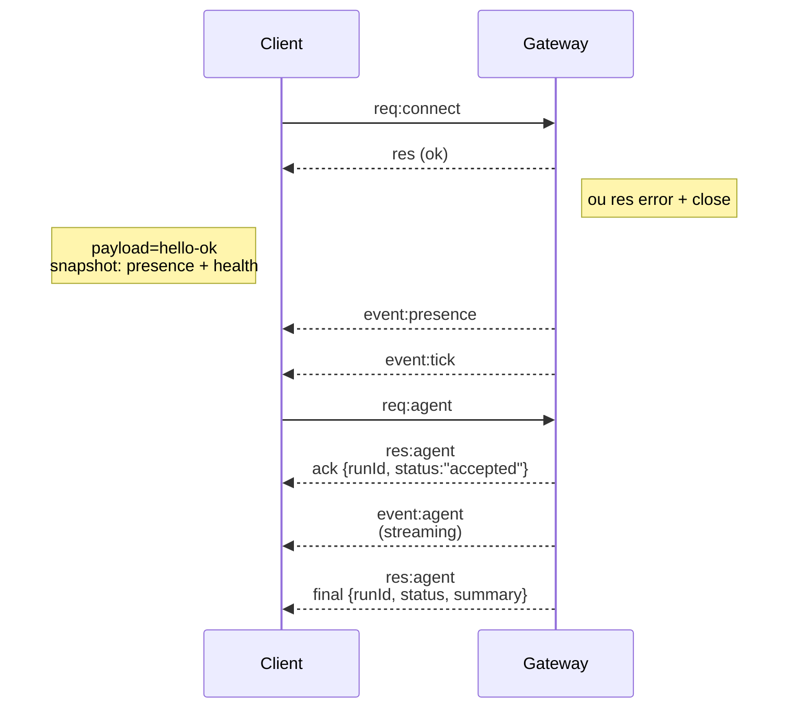

# Arquitetura do Gateway

Última atualização: 2026-01-22

## Visão geral

- Um único **Gateway** de longa duração possui todas as superfícies de mensagens (WhatsApp via
  Baileys, Telegram via grammY, Slack, Discord, Signal, iMessage, WebChat).
- Clientes do plano de controle (app macOS, CLI, web UI, automações) conectam ao
  Gateway via **WebSocket** no host de bind configurado (padrão
  `127.0.0.1:18789`).
- **Nodes** (macOS/iOS/Android/headless) também conectam via **WebSocket**, mas
  declaram `role: node` com caps/comandos explícitos.
- Um Gateway por host; é o único lugar que abre uma sessão WhatsApp.
- O **canvas host** é servido pelo servidor HTTP do Gateway em:
  - `/__opencraft__/canvas/` (HTML/CSS/JS editável pelo agente)
  - `/__opencraft__/a2ui/` (host A2UI)
    Usa a mesma porta do Gateway (padrão `18789`).

## Componentes e fluxos

### Gateway (daemon)

- Mantém conexões de provedores.
- Expõe uma API WS tipada (requisições, respostas, eventos push do servidor).
- Valida frames de entrada contra JSON Schema.
- Emite eventos como `agent`, `chat`, `presence`, `health`, `heartbeat`, `cron`.

### Clientes (app mac / CLI / web admin)

- Uma conexão WS por cliente.
- Enviam requisições (`health`, `status`, `send`, `agent`, `system-presence`).
- Se inscrevem em eventos (`tick`, `agent`, `presence`, `shutdown`).

### Nodes (macOS / iOS / Android / headless)

- Conectam ao **mesmo servidor WS** com `role: node`.
- Fornecem uma identidade de dispositivo no `connect`; o pareamento é **baseado em dispositivo** (role `node`) e
  a aprovação fica no armazenamento de pareamento de dispositivos.
- Expõem comandos como `canvas.*`, `camera.*`, `screen.record`, `location.get`.

Detalhes do protocolo:

- [Protocolo do Gateway](/gateway/protocol)

### WebChat

- UI estática que usa a API WS do Gateway para histórico de chat e envios.
- Em configurações remotas, conecta através do mesmo túnel SSH/Tailscale que outros
  clientes.

## Ciclo de vida da conexão (cliente único)



## Protocolo de comunicação (resumo)

- Transporte: WebSocket, frames de texto com payloads JSON.
- O primeiro frame **deve** ser `connect`.
- Após o handshake:
  - Requisições: `{type:"req", id, method, params}` → `{type:"res", id, ok, payload|error}`
  - Eventos: `{type:"event", event, payload, seq?, stateVersion?}`
- Se `OPENCLAW_GATEWAY_TOKEN` (ou `--token`) estiver definido, `connect.params.auth.token`
  deve corresponder ou o socket é fechado.
- Chaves de idempotência são obrigatórias para métodos com efeitos colaterais (`send`, `agent`) para
  retentativas seguras; o servidor mantém um cache de deduplicação de curta duração.
- Nodes devem incluir `role: "node"` mais caps/comandos/permissões no `connect`.

## Pareamento + confiança local

- Todos os clientes WS (operadores + nodes) incluem uma **identidade de dispositivo** no `connect`.
- Novos IDs de dispositivo requerem aprovação de pareamento; o Gateway emite um **token de dispositivo**
  para conexões subsequentes.
- Conexões **locais** (loopback ou endereço tailnet do próprio host do Gateway) podem ser
  auto-aprovadas para manter a UX do mesmo host fluida.
- Todas as conexões devem assinar o nonce `connect.challenge`.
- O payload de assinatura `v3` também vincula `platform` + `deviceFamily`; o Gateway
  fixa metadados pareados na reconexão e exige reparo de pareamento para mudanças
  de metadados.
- Conexões **não-locais** ainda requerem aprovação explícita.
- Autenticação do Gateway (`gateway.auth.*`) ainda se aplica a **todas** as conexões, locais ou
  remotas.

Detalhes: [Protocolo do Gateway](/gateway/protocol), [Pareamento](/channels/pairing),
[Segurança](/gateway/security).

## Tipagem de protocolo e codegen

- Schemas TypeBox definem o protocolo.
- JSON Schema é gerado a partir desses schemas.
- Modelos Swift são gerados a partir do JSON Schema.

## Acesso remoto

- Preferido: Tailscale ou VPN.
- Alternativa: túnel SSH

  ```bash
  ssh -N -L 18789:127.0.0.1:18789 user@host
  ```

- O mesmo handshake + token de autenticação se aplica pelo túnel.
- TLS + pinning opcional pode ser habilitado para WS em configurações remotas.

## Snapshot de operações

- Iniciar: `opencraft gateway` (foreground, logs para stdout).
- Saúde: `health` via WS (também incluído no `hello-ok`).
- Supervisão: launchd/systemd para auto-restart.

## Invariantes

- Exatamente um Gateway controla uma única sessão Baileys por host.
- O handshake é obrigatório; qualquer frame não-JSON ou não-connect como primeiro frame é um fechamento forçado.
- Eventos não são reproduzidos; clientes devem atualizar em caso de lacunas.
