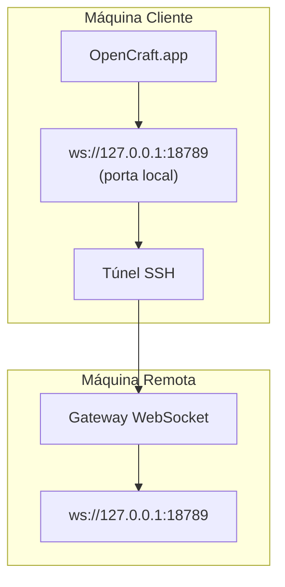

# Rodando o OpenCraft.app com um Gateway Remoto

O OpenCraft.app usa tunelamento SSH para conectar a um gateway remoto. Este guia mostra como configurá-lo.

## Visão geral



## Configuração rápida

### Passo 1: Adicione a configuração SSH

Edite `~/.ssh/config` e adicione:

```ssh
Host remote-gateway
    HostName <REMOTE_IP>          # ex., 172.27.187.184
    User <REMOTE_USER>            # ex., usuario
    LocalForward 18789 127.0.0.1:18789
    IdentityFile ~/.ssh/id_rsa
```

Substitua `<REMOTE_IP>` e `<REMOTE_USER>` pelos seus valores.

### Passo 2: Copie a chave SSH

Copie sua chave pública para a máquina remota (insira a senha uma vez):

```bash
ssh-copy-id -i ~/.ssh/id_rsa <REMOTE_USER>@<REMOTE_IP>
```

### Passo 3: Defina o token do Gateway

```bash
launchctl setenv OPENCLAW_GATEWAY_TOKEN "<seu-token>"
```

### Passo 4: Inicie o túnel SSH

```bash
ssh -N remote-gateway &
```

### Passo 5: Reinicie o OpenCraft.app

```bash
# Feche o OpenCraft.app (⌘Q), depois reabra:
open /path/to/OpenCraft.app
```

O app agora conectará ao gateway remoto através do túnel SSH.

---

## Iniciar o túnel automaticamente no login

Para que o túnel SSH inicie automaticamente quando você fizer login, crie um Launch Agent.

### Crie o arquivo PLIST

Salve como `~/Library/LaunchAgents/ai.opencraft.ssh-tunnel.plist`:

```xml
<?xml version="1.0" encoding="UTF-8"?>
<!DOCTYPE plist PUBLIC "-//Apple//DTD PLIST 1.0//EN" "http://www.apple.com/DTDs/PropertyList-1.0.dtd">
<plist version="1.0">
<dict>
    <key>Label</key>
    <string>ai.opencraft.ssh-tunnel</string>
    <key>ProgramArguments</key>
    <array>
        <string>/usr/bin/ssh</string>
        <string>-N</string>
        <string>remote-gateway</string>
    </array>
    <key>KeepAlive</key>
    <true/>
    <key>RunAtLoad</key>
    <true/>
</dict>
</plist>
```

### Carregue o Launch Agent

```bash
launchctl bootstrap gui/$UID ~/Library/LaunchAgents/ai.opencraft.ssh-tunnel.plist
```

O túnel agora irá:

- Iniciar automaticamente quando você fizer login
- Reiniciar se cair
- Continuar rodando em background

Nota legada: remova qualquer LaunchAgent `com.openclaw.ssh-tunnel` restante se presente.

---

## Resolução de problemas

**Verificar se o túnel está rodando:**

```bash
ps aux | grep "ssh -N remote-gateway" | grep -v grep
lsof -i :18789
```

**Reiniciar o túnel:**

```bash
launchctl kickstart -k gui/$UID/ai.opencraft.ssh-tunnel
```

**Parar o túnel:**

```bash
launchctl bootout gui/$UID/ai.opencraft.ssh-tunnel
```

---

## Como funciona

| Componente                           | O que faz                                                       |
| ------------------------------------ | --------------------------------------------------------------- |
| `LocalForward 18789 127.0.0.1:18789` | Encaminha porta local 18789 para porta remota 18789             |
| `ssh -N`                             | SSH sem executar comandos remotos (apenas encaminhamento de porta) |
| `KeepAlive`                          | Reinicia automaticamente o túnel se cair                        |
| `RunAtLoad`                          | Inicia o túnel quando o agente é carregado                      |

O OpenCraft.app conecta a `ws://127.0.0.1:18789` na sua máquina cliente. O túnel SSH encaminha essa conexão para a porta 18789 na máquina remota onde o Gateway está rodando.
