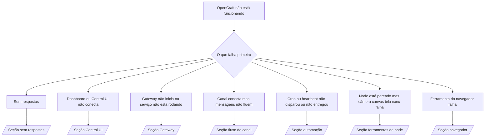

# Solução de problemas

Se você tem apenas 2 minutos, use esta página como porta de entrada para triagem.

## Primeiros 60 segundos

Execute esta sequência exata em ordem:

```bash
opencraft status
opencraft status --all
opencraft gateway probe
opencraft gateway status
opencraft doctor
opencraft channels status --probe
opencraft logs --follow
```

Boa saída em uma linha:

- `opencraft status` → mostra canais configurados e nenhum erro óbvio de autenticação.
- `opencraft status --all` → relatório completo presente e compartilhável.
- `opencraft gateway probe` → alvo esperado do gateway é alcançável (`Reachable: yes`). `RPC: limited - missing scope: operator.read` é diagnóstico degradado, não uma falha de conexão.
- `opencraft gateway status` → `Runtime: running` e `RPC probe: ok`.
- `opencraft doctor` → sem erros bloqueantes de config/serviço.
- `opencraft channels status --probe` → canais reportam `connected` ou `ready`.
- `opencraft logs --follow` → atividade constante, sem erros fatais repetitivos.

## Anthropic long context 429

Se você vir:
`HTTP 429: rate_limit_error: Extra usage is required for long context requests`,
vá para [/gateway/troubleshooting#anthropic-429-extra-usage-required-for-long-context](/gateway/troubleshooting#anthropic-429-extra-usage-required-for-long-context).

## Instalação de Plugin falha com extensões opencraft faltando

Se a instalação falhar com `package.json missing opencraft.extensions`, o pacote do Plugin
está usando um formato antigo que o OpenCraft não aceita mais.

Correção no pacote do Plugin:

1. Adicione `opencraft.extensions` ao `package.json`.
2. Aponte entradas para arquivos runtime compilados (geralmente `./dist/index.js`).
3. Republique o Plugin e execute `opencraft plugins install <npm-spec>` novamente.

Exemplo:

```json
{
  "name": "@opencraft/my-plugin",
  "version": "1.2.3",
  "opencraft": {
    "extensions": ["./dist/index.js"]
  }
}
```

Referência: [/tools/plugin#distribution-npm](/tools/plugin#distribution-npm)

## Árvore de decisão



<AccordionGroup>
  <Accordion title="Sem respostas">
    ```bash
    opencraft status
    opencraft gateway status
    opencraft channels status --probe
    opencraft pairing list --channel <channel> [--account <id>]
    opencraft logs --follow
    ```

    Boa saída se parece com:

    - `Runtime: running`
    - `RPC probe: ok`
    - Seu canal mostra connected/ready em `channels status --probe`
    - Remetente aparece aprovado (ou política de DM é open/allowlist)

    Assinaturas comuns nos logs:

    - `drop guild message (mention required` → barreira de menção bloqueou a mensagem no Discord.
    - `pairing request` → remetente não está aprovado e aguardando aprovação de pareamento DM.
    - `blocked` / `allowlist` nos logs do canal → remetente, sala ou grupo está filtrado.

    Páginas detalhadas:

    - [/gateway/troubleshooting#no-replies](/gateway/troubleshooting#no-replies)
    - [/channels/troubleshooting](/channels/troubleshooting)
    - [/channels/pairing](/channels/pairing)

  </Accordion>

  <Accordion title="Dashboard ou Control UI não conecta">
    ```bash
    opencraft status
    opencraft gateway status
    opencraft logs --follow
    opencraft doctor
    opencraft channels status --probe
    ```

    Boa saída se parece com:

    - `Dashboard: http://...` é mostrado em `opencraft gateway status`
    - `RPC probe: ok`
    - Sem loop de autenticação nos logs

    Assinaturas comuns nos logs:

    - `device identity required` → contexto HTTP/não-seguro não consegue completar autenticação de dispositivo.
    - `AUTH_TOKEN_MISMATCH` com dicas de retry (`canRetryWithDeviceToken=true`) → uma tentativa automática com token de dispositivo confiável pode ocorrer.
    - `unauthorized` repetido após essa tentativa → token/senha errado, incompatibilidade de modo de autenticação, ou token de dispositivo pareado obsoleto.
    - `gateway connect failed:` → UI está mirando URL/porta errada ou gateway inacessível.

    Páginas detalhadas:

    - [/gateway/troubleshooting#dashboard-control-ui-connectivity](/gateway/troubleshooting#dashboard-control-ui-connectivity)
    - [/web/control-ui](/web/control-ui)
    - [/gateway/authentication](/gateway/authentication)

  </Accordion>

  <Accordion title="Gateway não inicia ou serviço instalado mas não rodando">
    ```bash
    opencraft status
    opencraft gateway status
    opencraft logs --follow
    opencraft doctor
    opencraft channels status --probe
    ```

    Boa saída se parece com:

    - `Service: ... (loaded)`
    - `Runtime: running`
    - `RPC probe: ok`

    Assinaturas comuns nos logs:

    - `Gateway start blocked: set gateway.mode=local` → modo do gateway não está definido/está remoto.
    - `refusing to bind gateway ... without auth` → bind não-loopback sem token/senha.
    - `another gateway instance is already listening` ou `EADDRINUSE` → porta já em uso.

    Páginas detalhadas:

    - [/gateway/troubleshooting#gateway-service-not-running](/gateway/troubleshooting#gateway-service-not-running)
    - [/gateway/background-process](/gateway/background-process)
    - [/gateway/configuration](/gateway/configuration)

  </Accordion>

  <Accordion title="Canal conecta mas mensagens não fluem">
    ```bash
    opencraft status
    opencraft gateway status
    opencraft logs --follow
    opencraft doctor
    opencraft channels status --probe
    ```

    Boa saída se parece com:

    - Transporte do canal está conectado.
    - Verificações de pareamento/allowlist passam.
    - Menções são detectadas onde necessário.

    Assinaturas comuns nos logs:

    - `mention required` → barreira de menção do grupo bloqueou processamento.
    - `pairing` / `pending` → remetente DM ainda não está aprovado.
    - `not_in_channel`, `missing_scope`, `Forbidden`, `401/403` → problema de token de permissão do canal.

    Páginas detalhadas:

    - [/gateway/troubleshooting#channel-connected-messages-not-flowing](/gateway/troubleshooting#channel-connected-messages-not-flowing)
    - [/channels/troubleshooting](/channels/troubleshooting)

  </Accordion>

  <Accordion title="Cron ou heartbeat não disparou ou não entregou">
    ```bash
    opencraft status
    opencraft gateway status
    opencraft cron status
    opencraft cron list
    opencraft cron runs --id <jobId> --limit 20
    opencraft logs --follow
    ```

    Boa saída se parece com:

    - `cron.status` mostra habilitado com próximo wake.
    - `cron runs` mostra entradas recentes `ok`.
    - Heartbeat está habilitado e não fora do horário ativo.

    Assinaturas comuns nos logs:

    - `cron: scheduler disabled; jobs will not run automatically` → cron está desabilitado.
    - `heartbeat skipped` com `reason=quiet-hours` → fora do horário ativo configurado.
    - `requests-in-flight` → lane principal ocupada; wake do heartbeat foi adiado.
    - `unknown accountId` → conta alvo de entrega do heartbeat não existe.

    Páginas detalhadas:

    - [/gateway/troubleshooting#cron-and-heartbeat-delivery](/gateway/troubleshooting#cron-and-heartbeat-delivery)
    - [/automation/troubleshooting](/automation/troubleshooting)
    - [/gateway/heartbeat](/gateway/heartbeat)

  </Accordion>

  <Accordion title="Node está pareado mas ferramenta falha câmera canvas tela exec">
    ```bash
    opencraft status
    opencraft gateway status
    opencraft nodes status
    opencraft nodes describe --node <idOrNameOrIp>
    opencraft logs --follow
    ```

    Boa saída se parece com:

    - Node está listado como conectado e pareado para role `node`.
    - Capacidade existe para o comando que você está invocando.
    - Estado de permissão está concedido para a ferramenta.

    Assinaturas comuns nos logs:

    - `NODE_BACKGROUND_UNAVAILABLE` → traga app do node para primeiro plano.
    - `*_PERMISSION_REQUIRED` → permissão do SO negada/faltando.
    - `SYSTEM_RUN_DENIED: approval required` → aprovação exec está pendente.
    - `SYSTEM_RUN_DENIED: allowlist miss` → comando não está na allowlist exec.

    Páginas detalhadas:

    - [/gateway/troubleshooting#node-paired-tool-fails](/gateway/troubleshooting#node-paired-tool-fails)
    - [/nodes/troubleshooting](/nodes/troubleshooting)
    - [/tools/exec-approvals](/tools/exec-approvals)

  </Accordion>

  <Accordion title="Ferramenta do navegador falha">
    ```bash
    opencraft status
    opencraft gateway status
    opencraft browser status
    opencraft logs --follow
    opencraft doctor
    ```

    Boa saída se parece com:

    - Status do navegador mostra `running: true` e um navegador/perfil escolhido.
    - `opencraft` inicia, ou `user` pode ver abas locais do Chrome.

    Assinaturas comuns nos logs:

    - `Failed to start Chrome CDP on port` → inicialização do navegador local falhou.
    - `browser.executablePath not found` → caminho binário configurado está errado.
    - `No Chrome tabs found for profile="user"` → o perfil attach do Chrome MCP não tem abas locais abertas do Chrome.
    - `Browser attachOnly is enabled ... not reachable` → perfil attach-only não tem alvo CDP ativo.

    Páginas detalhadas:

    - [/gateway/troubleshooting#browser-tool-fails](/gateway/troubleshooting#browser-tool-fails)
    - [/tools/browser-linux-troubleshooting](/tools/browser-linux-troubleshooting)
    - [/tools/browser-wsl2-windows-remote-cdp-troubleshooting](/tools/browser-wsl2-windows-remote-cdp-troubleshooting)

  </Accordion>
</AccordionGroup>
