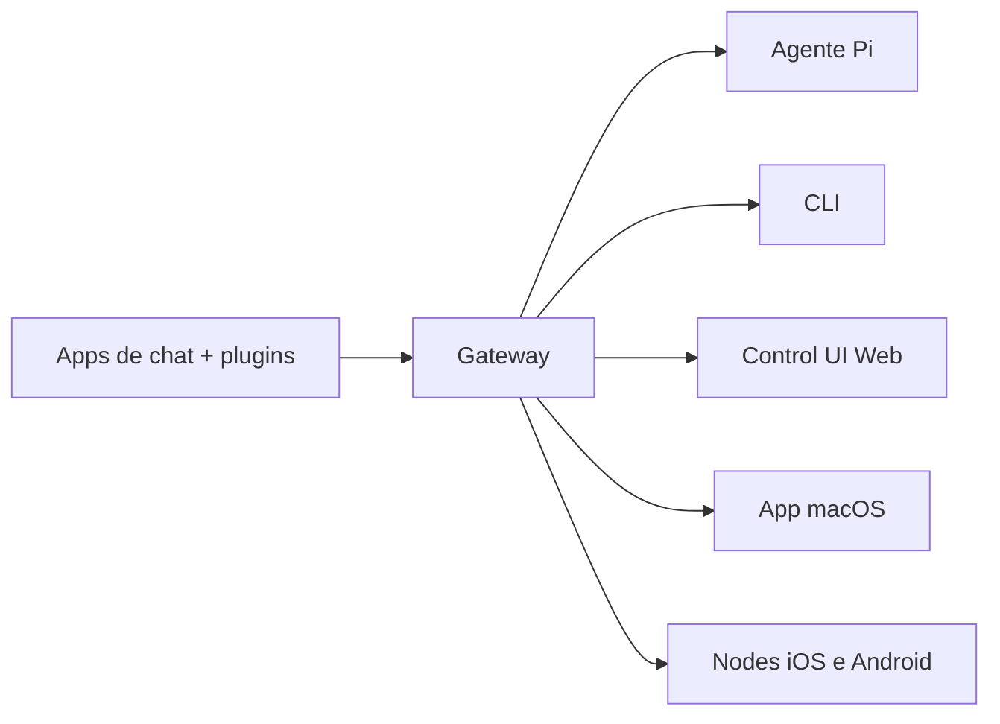

# OpenCraft 🦞

<p align="center">
    
    
</p>

> _"EXFOLIATE! EXFOLIATE!"_ — Uma lagosta espacial, provavelmente

<p align="center">
  <strong>Gateway para qualquer OS para agentes de IA via WhatsApp, Telegram, Discord, iMessage e mais.</strong><br />
  Envie uma mensagem, receba uma resposta do agente do seu bolso. Plugins adicionam Mattermost e mais.
</p>

<Columns>
  <Card title="Começar" href="/start/getting-started" icon="rocket">
    Instale o OpenCraft e suba o Gateway em minutos.
  </Card>
  <Card title="Rodar o Wizard" href="/start/wizard" icon="sparkles">
    Configuração guiada com `opencraft onboard` e fluxos de pareamento.
  </Card>
  <Card title="Abrir a Control UI" href="/web/control-ui" icon="layout-dashboard">
    Abra o dashboard do browser para chat, config e sessões.
  </Card>
</Columns>

## O que é o OpenCraft?

O OpenCraft é um **gateway auto-hospedado** que conecta seus apps de chat favoritos — WhatsApp, Telegram, Discord, iMessage e mais — a agentes de IA de codificação como o Pi. Você roda um único processo Gateway na sua própria máquina (ou servidor), e ele se torna a ponte entre seus apps de mensagens e um assistente de IA sempre disponível.

**Para quem é?** Desenvolvedores e usuários avançados que querem um assistente de IA pessoal que podem acessar de qualquer lugar — sem abrir mão do controle dos seus dados ou depender de um serviço hospedado.

**O que o diferencia?**

- **Auto-hospedado**: roda no seu hardware, suas regras
- **Multi-canal**: um único Gateway serve WhatsApp, Telegram, Discord e mais simultaneamente
- **Nativo para agentes**: construído para agentes de codificação com uso de tools, sessões, memória e roteamento multi-agente
- **Código aberto**: licença MIT, orientado pela comunidade

**O que você precisa?** Node 24 (recomendado), ou Node 22 LTS (`22.16+`) para compatibilidade, uma chave de API do provedor de sua escolha e 5 minutos. Para melhor qualidade e segurança, use o modelo mais forte e recente disponível.

## Como funciona



O Gateway é a fonte única da verdade para sessões, roteamento e conexões de canal.

## Capacidades principais

<Columns>
  <Card title="Gateway multi-canal" icon="network">
    WhatsApp, Telegram, Discord e iMessage com um único processo Gateway.
  </Card>
  <Card title="Canais por plugin" icon="plug">
    Adicione Mattermost e mais com pacotes de extensão.
  </Card>
  <Card title="Roteamento multi-agente" icon="route">
    Sessões isoladas por agente, workspace ou remetente.
  </Card>
  <Card title="Suporte a mídia" icon="image">
    Envie e receba imagens, áudio e documentos.
  </Card>
  <Card title="Control UI Web" icon="monitor">
    Dashboard no browser para chat, config, sessões e nodes.
  </Card>
  <Card title="Nodes móveis" icon="smartphone">
    Pareie nodes iOS e Android para workflows com Canvas, câmera e voz.
  </Card>
</Columns>

## Início rápido

<Steps>
  <Step title="Instalar o OpenCraft">
    ```bash
    npm install -g opencraft@latest
    ```
  </Step>
  <Step title="Onboarding e instalar o serviço">
    ```bash
    opencraft onboard --install-daemon
    ```
  </Step>
  <Step title="Parear o WhatsApp e iniciar o Gateway">
    ```bash
    opencraft channels login
    opencraft gateway --port 18789
    ```
  </Step>
</Steps>

Precisa do setup completo de instalação e dev? Veja [Início rápido](/start/quickstart).

## Dashboard

Abra a Control UI no browser após o Gateway iniciar.

- Padrão local: [http://127.0.0.1:18789/](http://127.0.0.1:18789/)
- Acesso remoto: [Superfícies Web](/web) e [Tailscale](/gateway/tailscale)

<p align="center">
  
</p>

## Configuração (opcional)

A config fica em `~/.opencraft/opencraft.json`.

- Se você **não fizer nada**, o OpenCraft usa o binário Pi embutido em modo RPC com sessões por remetente.
- Se quiser restringir o acesso, comece com `channels.whatsapp.allowFrom` e (para grupos) regras de menção.

Exemplo:

```json5
{
  channels: {
    whatsapp: {
      allowFrom: ["+5511999999999"],
      groups: { "*": { requireMention: true } },
    },
  },
  messages: { groupChat: { mentionPatterns: ["@opencraft"] } },
}
```

## Comece aqui

<Columns>
  <Card title="Hubs de docs" href="/start/hubs" icon="book-open">
    Todos os docs e guias, organizados por caso de uso.
  </Card>
  <Card title="Configuração" href="/gateway/configuration" icon="settings">
    Configurações principais do Gateway, tokens e config de provedor.
  </Card>
  <Card title="Acesso remoto" href="/gateway/remote" icon="globe">
    Padrões de acesso via SSH e tailnet.
  </Card>
  <Card title="Canais" href="/channels/telegram" icon="message-square">
    Setup específico de canal para WhatsApp, Telegram, Discord e mais.
  </Card>
  <Card title="Nodes" href="/nodes" icon="smartphone">
    Nodes iOS e Android com pareamento, Canvas, câmera e ações de dispositivo.
  </Card>
  <Card title="Ajuda" href="/help" icon="life-buoy">
    Correções comuns e ponto de entrada para resolução de problemas.
  </Card>
</Columns>

## Saiba mais

<Columns>
  <Card title="Lista completa de recursos" href="/concepts/features" icon="list">
    Capacidades completas de canal, roteamento e mídia.
  </Card>
  <Card title="Roteamento multi-agente" href="/concepts/multi-agent" icon="route">
    Isolamento de workspace e sessões por agente.
  </Card>
  <Card title="Segurança" href="/gateway/security" icon="shield">
    Tokens, allowlists e controles de segurança.
  </Card>
  <Card title="Resolução de problemas" href="/gateway/troubleshooting" icon="wrench">
    Diagnósticos do Gateway e erros comuns.
  </Card>
  <Card title="Sobre e créditos" href="/reference/credits" icon="info">
    Origens do projeto, contribuidores e licença.
  </Card>
</Columns>
