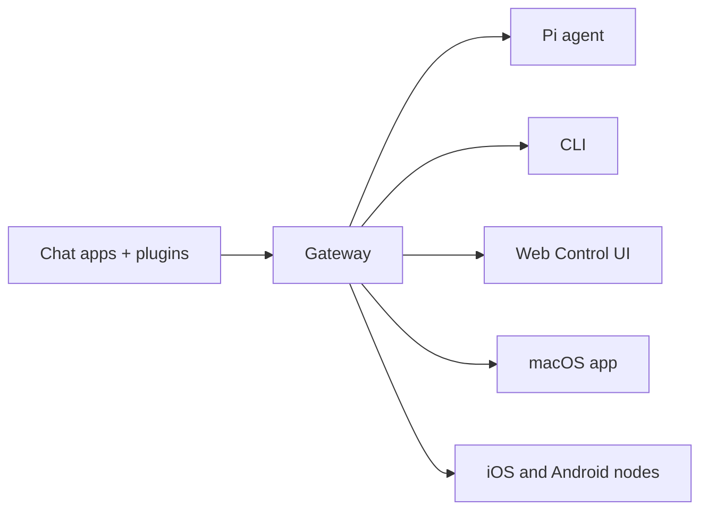

# OpenCraft 🦞

<p align="center">
    
    
</p>

> _"EXFOLIAR! EXFOLIAR!"_ — Um lagostim do espaço, provavelmente

<p align="center">
  <strong>Gateway para qualquer SO que conecta agentes de IA via WhatsApp, Telegram, Discord, iMessage e muito mais.</strong><br />
  Envie uma mensagem, obtenha uma resposta do agente do seu bolso. Plugins adicionam Mattermost e mais.
</p>

<Columns>
  <Card title="Comece Agora" href="/start/getting-started" icon="rocket">
    Instale o OpenCraft e ative o Gateway em minutos.
  </Card>
  <Card title="Execute Onboarding" href="/start/wizard" icon="sparkles">
    Configuração guiada com `opencraft onboard` e fluxos de pareamento.
  </Card>
  <Card title="Abra a Control UI" href="/web/control-ui" icon="layout-dashboard">
    Execute o painel do navegador para chat, configuração e sessões.
  </Card>
</Columns>

## O que é OpenCraft?

OpenCraft é um **gateway auto-hospedado** que conecta seus aplicativos de chat favoritos — WhatsApp, Telegram, Discord, iMessage e muito mais — a agentes de IA para codificação como Pi. Você executa um único processo Gateway na sua própria máquina (ou servidor), e ele se torna a ponte entre seus aplicativos de mensagens e um assistente de IA sempre disponível.

**Para quem é?** Desenvolvedores e usuários avançados que desejam um assistente de IA pessoal que possam contatar de qualquer lugar — sem abrir mão do controle de seus dados ou depender de um serviço hospedado.

**O que o torna diferente?**

- **Auto-hospedado**: funciona no seu hardware, suas regras
- **Multicanal**: um Gateway atende WhatsApp, Telegram, Discord e muito mais simultaneamente
- **Nativo para agentes**: construído para agentes de codificação com uso de ferramentas, sessões, memória e roteamento multi-agente
- **Código aberto**: licença MIT, orientado pela comunidade

**O que você precisa?** Node 24 (recomendado), ou Node 22 LTS (`22.16+`) para compatibilidade, uma chave de API do seu provedor escolhido e 5 minutos. Para melhor qualidade e segurança, use o modelo de geração mais recente mais poderoso disponível.

## Como funciona



O Gateway é a única fonte de verdade para sessões, roteamento e conexões de canal.

## Capacidades principais

<Columns>
  <Card title="Gateway multicanal" icon="network">
    WhatsApp, Telegram, Discord e iMessage com um único processo Gateway.
  </Card>
  <Card title="Canais de plugin" icon="plug">
    Adicione Mattermost e mais com pacotes de extensão.
  </Card>
  <Card title="Roteamento multi-agente" icon="route">
    Sessões isoladas por agente, espaço de trabalho ou remetente.
  </Card>
  <Card title="Suporte a mídia" icon="image">
    Envie e receba imagens, áudio e documentos.
  </Card>
  <Card title="Web Control UI" icon="monitor">
    Painel do navegador para chat, configuração, sessões e nós.
  </Card>
  <Card title="Nós móveis" icon="smartphone">
    Associe nós iOS e Android para fluxos de trabalho Canvas, câmera e ativados por voz.
  </Card>
</Columns>

## Início rápido

<Steps>
  <Step title="Instale o OpenCraft">
    ```bash
    npm install -g opencraft@latest
    ```
  </Step>
  <Step title="Onboarding e instale o serviço">
    ```bash
    opencraft onboard --install-daemon
    ```
  </Step>
  <Step title="Empare o WhatsApp e inicie o Gateway">
    ```bash
    opencraft channels login
    opencraft gateway --port 18789
    ```
  </Step>
</Steps>

Precisa da instalação completa e configuração de dev? Veja [Início rápido](/start/quickstart).

## Painel

Abra a Control UI do navegador após o Gateway iniciar.

- Padrão local: [http://127.0.0.1:18789/](http://127.0.0.1:18789/)
- Acesso remoto: [Web surfaces](/web) e [Tailscale](/gateway/tailscale)

<p align="center">
  
</p>

## Configuração (opcional)

A configuração fica em `~/.editzffaleta/OpenCraft.json`.

- Se você **não fizer nada**, OpenCraft usa o binário Pi fornecido em modo RPC com sessões por remetente.
- Se você quiser bloqueá-lo, comece com `channels.whatsapp.allowFrom` e (para grupos) regras de menção.

Exemplo:

```json5
{
  channels: {
    whatsapp: {
      allowFrom: ["+15555550123"],
      groups: { "*": { requireMention: true } },
    },
  },
  messages: { groupChat: { mentionPatterns: ["@opencraft"] } },
}
```

## Comece aqui

<Columns>
  <Card title="Hubs de docs" href="/start/hubs" icon="book-open">
    Todos os documentos e guias, organizados por caso de uso.
  </Card>
  <Card title="Configuração" href="/gateway/configuration" icon="settings">
    Configurações principais do Gateway, tokens e configuração de provedor.
  </Card>
  <Card title="Acesso remoto" href="/gateway/remote" icon="globe">
    Padrões de acesso SSH e tailnet.
  </Card>
  <Card title="Canais" href="/channels/telegram" icon="message-square">
    Configuração específica do canal para WhatsApp, Telegram, Discord e muito mais.
  </Card>
  <Card title="Nós" href="/nodes" icon="smartphone">
    Nós iOS e Android com pareamento, Canvas, câmera e ações de dispositivo.
  </Card>
  <Card title="Ajuda" href="/help" icon="life-buoy">
    Correções comuns e ponto de entrada de solução de problemas.
  </Card>
</Columns>

## Saiba mais

<Columns>
  <Card title="Lista completa de recursos" href="/concepts/features" icon="list">
    Capacidades completas de canal, roteamento e mídia.
  </Card>
  <Card title="Roteamento multi-agente" href="/concepts/multi-agent" icon="route">
    Isolamento de espaço de trabalho e sessões por agente.
  </Card>
  <Card title="Segurança" href="/gateway/security" icon="shield">
    Tokens, listas de permissões e controles de segurança.
  </Card>
  <Card title="Solução de problemas" href="/gateway/troubleshooting" icon="wrench">
    Diagnósticos de Gateway e erros comuns.
  </Card>
  <Card title="Sobre e créditos" href="/reference/credits" icon="info">
    Origens do projeto, colaboradores e licença.
  </Card>
</Columns>
