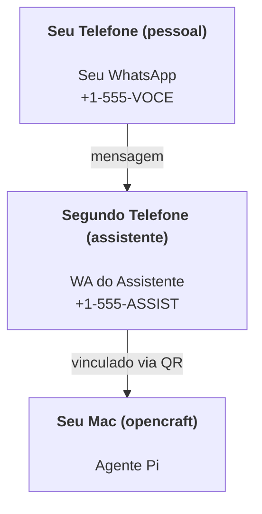

# Construindo um assistente pessoal com OpenCraft

O OpenCraft é um gateway de WhatsApp + Telegram + Discord + iMessage para agentes **Pi**. Plugins adicionam Mattermost. Este guia é a configuração de "assistente pessoal": um número WhatsApp dedicado que se comporta como seu agente sempre ativo.

## ⚠️ Segurança primeiro

Você está colocando um agente em posição de:

- executar comandos na sua máquina (dependendo da configuração de ferramentas Pi)
- ler/escrever arquivos no seu espaço de trabalho
- enviar mensagens via WhatsApp/Telegram/Discord/Mattermost (plugin)

Comece conservador:

- Sempre defina `channels.whatsapp.allowFrom` (nunca execute aberto ao mundo no seu Mac pessoal).
- Use um número WhatsApp dedicado para o assistente.
- Heartbeats agora são padrão a cada 30 minutos. Desabilite até confiar na configuração definindo `agents.defaults.heartbeat.every: "0m"`.

## Pré-requisitos

- OpenCraft instalado e onboarded — veja [Começando](/start/getting-started) se você ainda não fez isso
- Um segundo número de telefone (SIM/eSIM/pré-pago) para o assistente

## A configuração de dois telefones (recomendada)

Você quer isso:



Se você vincular seu WhatsApp pessoal ao OpenCraft, toda mensagem para você se torna "entrada do agente". Isso raramente é o que você quer.

## Quickstart de 5 minutos

1. Pareie o WhatsApp Web (mostra QR; escaneie com o telefone do assistente):

```bash
opencraft channels login
```

2. Inicie o Gateway (deixe executando):

```bash
opencraft gateway --port 18789
```

3. Coloque uma configuração mínima em `~/.editzffaleta/OpenCraft.json`:

```json5
{
  channels: { whatsapp: { allowFrom: ["+15555550123"] } },
}
```

Agora envie uma mensagem para o número do assistente do seu telefone na allowlist.

Quando o onboarding terminar, o dashboard abre automaticamente e imprime um link limpo (sem token). Se pedir autenticação, cole o token de `gateway.auth.token` nas configurações da Control UI. Para reabrir depois: `opencraft dashboard`.

## Dê ao agente um espaço de trabalho (AGENTS)

O OpenCraft lê instruções de operação e "memória" do seu diretório de espaço de trabalho.

Por padrão, o OpenCraft usa `~/.opencraft/workspace` como espaço de trabalho do agente, e criará automaticamente (mais `AGENTS.md`, `SOUL.md`, `TOOLS.md`, `IDENTITY.md`, `USER.md`, `HEARTBEAT.md` iniciais) na configuração/primeira execução do agente. `BOOTSTRAP.md` só é criado quando o espaço de trabalho é novo (não deve voltar depois que você apagá-lo). `MEMORY.md` é opcional (não criado automaticamente); quando presente, é carregado para sessões normais. Sessões de sub-agentes apenas injetam `AGENTS.md` e `TOOLS.md`.

Dica: trate esta pasta como a "memória" do OpenCraft e faça dela um repositório git (idealmente privado) para que seus arquivos `AGENTS.md` + de memória tenham backup. Se o git estiver instalado, espaços de trabalho novos são inicializados automaticamente.

```bash
opencraft setup
```

Layout completo do espaço de trabalho + guia de backup: [Espaço de trabalho do agente](/concepts/agent-workspace)
Fluxo de memória: [Memória](/concepts/memory)

Opcional: escolha um espaço de trabalho diferente com `agents.defaults.workspace` (suporta `~`).

```json5
{
  agent: {
    workspace: "~/.opencraft/workspace",
  },
}
```

Se você já envia seus próprios arquivos de espaço de trabalho de um repositório, pode desabilitar completamente a criação de arquivos de bootstrap:

```json5
{
  agent: {
    skipBootstrap: true,
  },
}
```

## A configuração que transforma em "um assistente"

O OpenCraft tem bons padrões para configuração de assistente, mas você geralmente vai querer ajustar:

- persona/instruções em `SOUL.md`
- padrões de pensamento (se desejado)
- heartbeats (quando confiar)

Exemplo:

```json5
{
  logging: { level: "info" },
  agent: {
    model: "anthropic/claude-opus-4-6",
    workspace: "~/.opencraft/workspace",
    thinkingDefault: "high",
    timeoutSeconds: 1800,
    // Comece com 0; habilite depois.
    heartbeat: { every: "0m" },
  },
  channels: {
    whatsapp: {
      allowFrom: ["+15555550123"],
      groups: {
        "*": { requireMention: true },
      },
    },
  },
  routing: {
    groupChat: {
      mentionPatterns: ["@opencraft", "opencraft"],
    },
  },
  session: {
    scope: "per-sender",
    resetTriggers: ["/new", "/reset"],
    reset: {
      mode: "daily",
      atHour: 4,
      idleMinutes: 10080,
    },
  },
}
```

## Sessões e memória

- Arquivos de sessão: `~/.opencraft/agents/<agentId>/sessions/{{SessionId}}.jsonl`
- Metadados de sessão (uso de tokens, última rota, etc): `~/.opencraft/agents/<agentId>/sessions/sessions.json` (legado: `~/.opencraft/sessions/sessions.json`)
- `/new` ou `/reset` inicia uma nova sessão para aquele chat (configurável via `resetTriggers`). Se enviado sozinho, o agente responde com um breve olá para confirmar o reset.
- `/compact [instruções]` compacta o contexto da sessão e reporta o orçamento de contexto restante.

## Heartbeats (modo proativo)

Por padrão, o OpenCraft executa um heartbeat a cada 30 minutos com o prompt:
`Read HEARTBEAT.md if it exists (workspace context). Follow it strictly. Do not infer or repeat old tasks from prior chats. If nothing needs attention, reply HEARTBEAT_OK.`
Defina `agents.defaults.heartbeat.every: "0m"` para desabilitar.

- Se `HEARTBEAT.md` existir mas estiver efetivamente vazio (apenas linhas em branco e cabeçalhos markdown como `# Heading`), o OpenCraft pula a execução do heartbeat para economizar chamadas de API.
- Se o arquivo estiver ausente, o heartbeat ainda executa e o modelo decide o que fazer.
- Se o agente responder com `HEARTBEAT_OK` (opcionalmente com padding curto; veja `agents.defaults.heartbeat.ackMaxChars`), o OpenCraft suprime a entrega de saída para aquele heartbeat.
- Por padrão, entrega de heartbeat para alvos estilo DM `user:<id>` é permitida. Defina `agents.defaults.heartbeat.directPolicy: "block"` para suprimir entrega de alvo direto mantendo as execuções de heartbeat ativas.
- Heartbeats executam turnos completos do agente — intervalos mais curtos consomem mais tokens.

```json5
{
  agent: {
    heartbeat: { every: "30m" },
  },
}
```

## Mídia entrada e saída

Anexos de entrada (imagens/áudio/docs) podem ser exibidos ao seu comando via templates:

- `{{MediaPath}}` (caminho de arquivo temporário local)
- `{{MediaUrl}}` (pseudo-URL)
- `{{Transcript}}` (se transcrição de áudio estiver habilitada)

Anexos de saída do agente: inclua `MEDIA:<caminho-ou-url>` em sua própria linha (sem espaços). Exemplo:

```
Aqui está a captura de tela.
MEDIA:https://example.com/screenshot.png
```

O OpenCraft extrai esses e envia como mídia junto com o texto.

## Checklist de operações

```bash
opencraft status          # status local (credenciais, sessões, eventos enfileirados)
opencraft status --all    # diagnóstico completo (somente leitura, colável)
opencraft status --deep   # adiciona probes de saúde do gateway (Telegram + Discord)
opencraft health --json   # snapshot de saúde do gateway (WS)
```

Logs ficam em `/tmp/opencraft/` (padrão: `opencraft-YYYY-MM-DD.log`).

## Próximos passos

- WebChat: [WebChat](/web/webchat)
- Operações do Gateway: [Runbook do Gateway](/gateway)
- Cron + despertares: [Cron jobs](/automation/cron-jobs)
- Complemento da barra de menu macOS: [App macOS OpenCraft](/platforms/macos)
- App node iOS: [App iOS](/platforms/ios)
- App node Android: [App Android](/platforms/android)
- Status Windows: [Windows (WSL2)](/platforms/windows)
- Status Linux: [App Linux](/platforms/linux)
- Segurança: [Segurança](/gateway/security)
